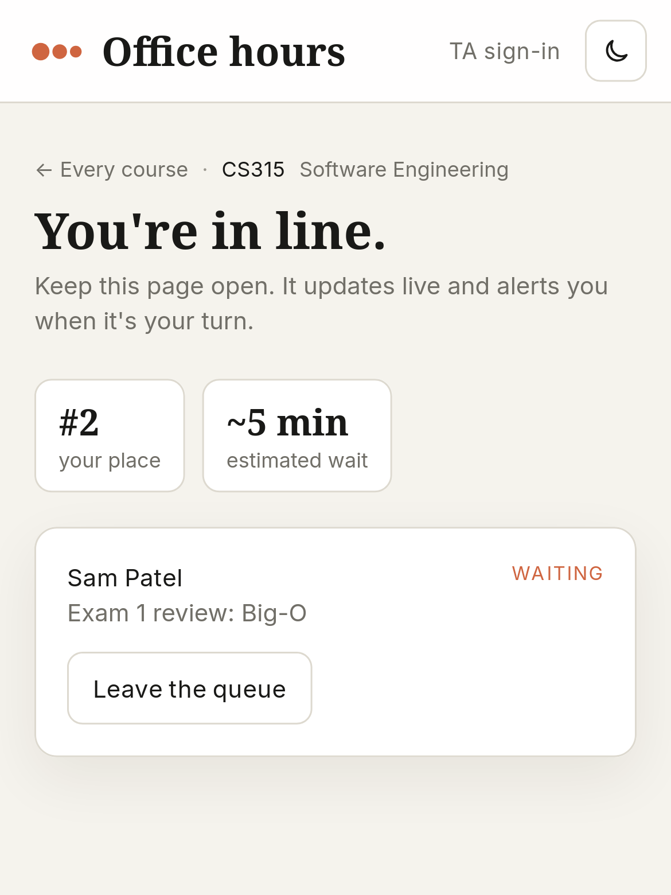
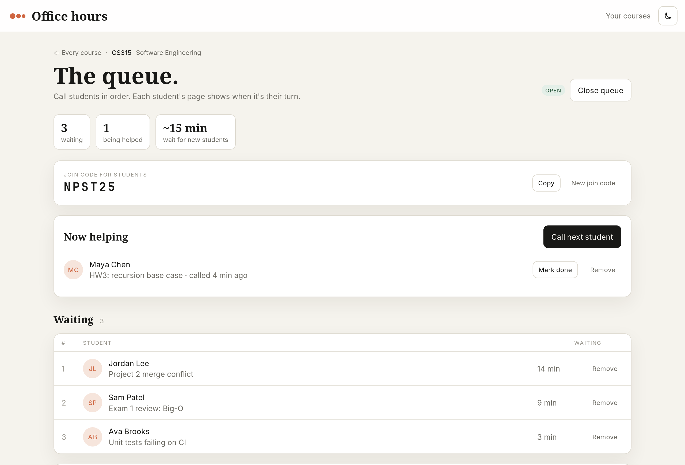
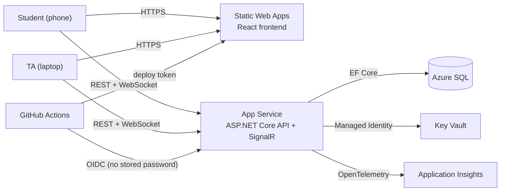

# Office Hours Queue

A real-time queue for university office hours. Students join from their phone with a course's join code and watch their place in line update live. TAs call the next student, mark students as helped, and open or close the queue. Each course has its own queue, and a course can have several TAs.

**Live:** https://ohq.hbhuy.me

| Student (phone) | TA (laptop) |
|---|---|
|  |  |

## Features

- **Students** don't sign in. They pick a course (or type just its join code), join with their name and topic, and see their position and estimated wait. The page updates live and alerts them when they're called.
- **TAs** sign in with email and password. They open and close the queue, call the next student, mark students done or remove them, rotate the join code, and add co-TAs.
- **The admin** (one account, set by `Admin:Email`) sees every course, can manage any course and its TAs, and can delete TA accounts through the API.
- Only the TA who created a course, or the admin, can delete it.

## Architecture



Everything in Azure is created by Terraform (`infra/`), with its state kept in Azure Storage.

- **Real-time:** SignalR works as a doorbell. After any change, the server sends `QueueChanged` to that course's pages, and they re-fetch over REST.
- **Secrets:** the database connection string lives in Key Vault. The API reads it at startup with its Managed Identity, so no password is in code, config, or GitHub.
- **Deploys:** GitHub Actions signs in to Azure with OIDC (a short-lived token per run, trusted only for pushes to `main`), builds once, and deploys the output.
- **Database:** EF Core migrations run when the API starts, so a deploy also updates the schema.

## Tech stack

| | |
|---|---|
| API | ASP.NET Core 10 (controllers), EF Core, SignalR, ASP.NET Core Identity (bearer tokens) |
| Frontend | React, TypeScript, Vite, Tailwind CSS |
| Azure | App Service, Static Web Apps, Azure SQL, Key Vault, Application Insights, Log Analytics |
| Infra and CI/CD | Terraform (azurerm), GitHub Actions |

```
api/        ASP.NET Core API (controllers, EF Core models and migrations, SignalR hub)
web/        React frontend
infra/      Terraform, plus bootstrap.sh and github-sync.sh
.github/    deploy workflows for the API and the frontend
```

## Run it locally

You need the .NET 10 SDK, Node 24+, and Docker.

```bash
docker compose up -d                 # SQL Server on localhost:1433
dotnet run --project api             # API on http://localhost:5080; applies migrations on start
npm --prefix web install
npm --prefix web run dev             # frontend on http://localhost:5173
```

`api/OfficeHours.Api.http` has a request for every endpoint. To be the admin locally, register the account whose email matches `Admin:Email` in `api/appsettings.json`.

## Deploy your own copy

You need the Azure CLI, Terraform, and the GitHub CLI, signed in to each.

1. **State storage:** run `infra/bootstrap.sh` once. Put the storage account name it prints into the `backend` block in `infra/providers.tf`.
2. **Variables:** copy `infra/terraform.tfvars.example` to `infra/terraform.tfvars` and set your `subscription_id`. Also set:
   - `github_repo`: your repo as GitHub's tokens name it, `owner@ownerId/repo@repoId` (`gh api repos/OWNER/REPO` shows both ids)
   - `custom_domain`: your frontend's address, like `ohq.example.com`
3. **Infrastructure:** the custom domain needs a CNAME record pointing at the Static Web App before Azure accepts it. So apply once with `-target=azurerm_static_web_app.main`, point the CNAME at the `web_default_host` output, then apply everything:
   ```bash
   terraform -chdir=infra init
   terraform -chdir=infra plan -out=main.tfplan
   terraform -chdir=infra apply main.tfplan
   ```
4. **GitHub settings:** run `infra/github-sync.sh`. It copies the Terraform outputs into the repo's Actions secrets and variables.
5. **Deploy:** push to `main`, or run both workflows from the Actions tab.
6. **Admin:** register the `Admin:Email` account right away, before sharing the link.

## Costs

| Resource | Tier | Cost |
|---|---|---|
| Azure SQL | Basic (5 DTU, 2 GB) | about $5/month |
| App Service | F1 | free |
| Static Web Apps | Free | free |
| Key Vault | Standard | pennies |
| Application Insights + Log Analytics | pay as you go, 0.1 GB/day cap | free under 5 GB/month |
| Terraform state storage | Standard LRS | pennies |

F1 allows 5 WebSocket connections at once and has no Always On, so the first request after the API sits idle takes a few seconds. Set `app_service_sku = "B1"` (about $13/month) for more.

<sub>This is a public mirror of the project for viewing. The live site deploys from a separate private repo, so this copy may sometimes be a little behind.</sub>
