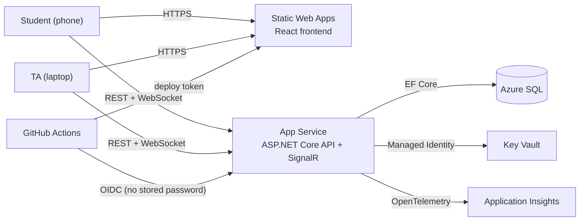

# Office Hours Queue

A real-time queue for university office hours. Students join from their phone with a course's join code and watch their place in line update live. TAs call the next student, mark students as helped, and open or close the queue. Each course has its own queue, and a course can have several TAs.

**Live:** https://ohq.hbhuy.me

| Student (phone) | TA (laptop) |
|---|---|
|  |  |

## Features

- **Students** don't sign in. They pick a course (or type just its join code), join with their name and topic, and see their position and estimated wait. The page updates live and alerts them when they're called.
- **TAs** sign in with email and password. They open and close the queue, call the next student, mark students done or remove them, rotate the join code, and add co-TAs.
- **The admin** (one account, set by `Admin:Email`) sees every course, can manage any course and its TAs, and can delete TA accounts through the API.
- Only the TA who created a course, or the admin, can delete it.

## Architecture



All of the Azure resources are created with Terraform (`infra/`).

- **Live updates:** when something changes, the server tells every open page for that course, and each page reloads its data.
- **Secrets:** the database password is kept in Key Vault, not in the code. The API gets it using its own Azure identity, so no password is stored in the repo or in GitHub.
- **Deploys:** every push to `main` builds and deploys the app with GitHub Actions. It signs in to Azure with a short-lived token for each run instead of a saved password.
- **Database:** schema changes are applied automatically when the API starts.
- **Monitoring:** requests, errors, and logs are sent to Application Insights.

## Tech stack

| | |
|---|---|
| API | ASP.NET Core 10 (controllers), EF Core, SignalR, ASP.NET Core Identity (bearer tokens) |
| Frontend | React, TypeScript, Vite, Tailwind CSS |
| Azure | App Service, Static Web Apps, Azure SQL, Key Vault, Application Insights, Log Analytics |
| Infra and CI/CD | Terraform (azurerm), GitHub Actions |

```
api/        ASP.NET Core API (controllers, EF Core models and migrations, SignalR hub)
web/        React frontend
infra/      Terraform, plus bootstrap.sh and github-sync.sh
.github/    deploy workflows for the API and the frontend
```

## Run it locally

You need the .NET 10 SDK, Node 24+, and Docker.

```bash
docker compose up -d                 # SQL Server on localhost:1433
dotnet run --project api             # API on http://localhost:5080; applies migrations on start
npm --prefix web install
npm --prefix web run dev             # frontend on http://localhost:5173
```

`api/OfficeHours.Api.http` has a request for every endpoint. To be the admin locally, register the account whose email matches `Admin:Email` in `api/appsettings.json`.

<sub>This is a public copy for viewing. The live site runs from a separate private repo, so this copy may sometimes be a little behind.</sub>
